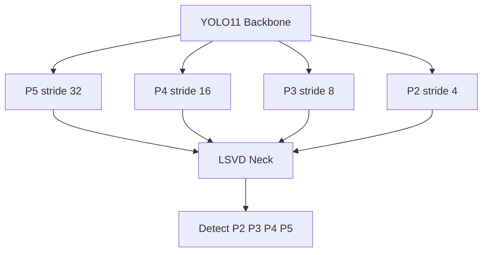
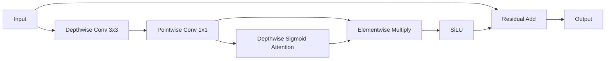
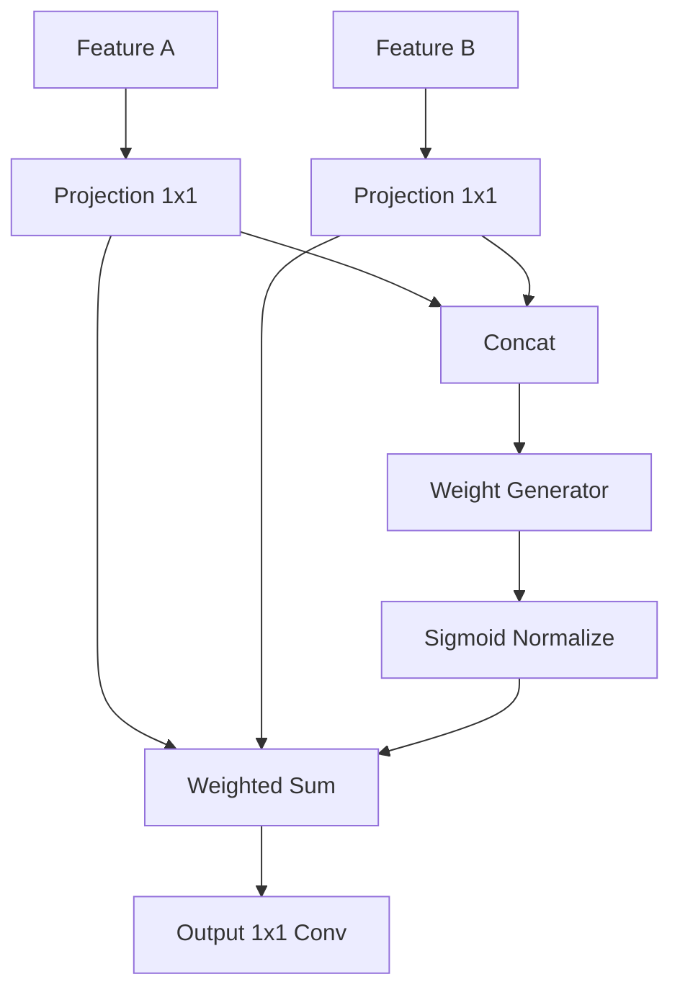
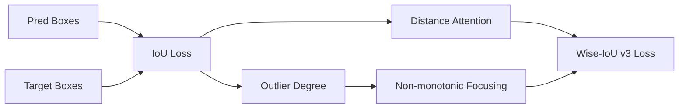

# YOLO11n-LSVD Perception Module

本文档记录 `yolo11n_lsvd.yaml` 的第一创新 Perception Module 设计，用于论文方向
“A Lightweight Small Vulnerable Pedestrian Detection Network for Intelligent Crossing Assistance”。

## 实现位置

- 模型配置：`ultralytics/cfg/models/11/yolo11n_lsvd.yaml`
- 新增模块：`ultralytics/nn/modules/lfem.py`
- 模块注册：`ultralytics/nn/modules/__init__.py`
- YAML 解析：`ultralytics/nn/tasks.py`
- Wise-IoU v3：`ultralytics/utils/loss.py`
- 默认开关：`ultralytics/cfg/default.yaml`

## 1. P2 Detection Layer

### Method

官方 YOLO11 检测头使用 P3、P4、P5 三个尺度，对远距离老人、儿童、轮椅等小目标的高分辨率细节保留不足。LSVD 在不修改 `Detect` 类的前提下，将 backbone 的 P2 特征引入 neck，并在最终检测头中使用 P2、P3、P4、P5 四尺度输入。

### Formula

给定四个尺度特征：

\\[
F_2 \\in \\mathbb{R}^{C_2 \\times H/4 \\times W/4},\\quad
F_3 \\in \\mathbb{R}^{C_3 \\times H/8 \\times W/8},\\quad
F_4 \\in \\mathbb{R}^{C_4 \\times H/16 \\times W/16},\\quad
F_5 \\in \\mathbb{R}^{C_5 \\times H/32 \\times W/32}
\\]

最终检测输出为：

\\[
Y = Detect(F_2, F_3, F_4, F_5)
\\]

### Verified Structure

640 输入下四个检测输入为：

| Layer | Scale | Shape |
| --- | --- | --- |
| 21 | P2/4 | `1 x 32 x 160 x 160` |
| 24 | P3/8 | `1 x 64 x 80 x 80` |
| 27 | P4/16 | `1 x 128 x 40 x 40` |
| 30 | P5/32 | `1 x 256 x 20 x 20` |

### Expected Effect

P2 增加高分辨率检测点，主要提升 `APS` 和远距离弱势行人召回率。代价是检测位置数从 8400 增加到 34000，理论 FPS 下降主要来自 P2 neck 和 Detect head。

## 2. LFEM

### Method

LFEM 用于增强 P2/P3 高分辨率特征中的边缘、轮廓和局部纹理。模块仅使用 depthwise convolution、pointwise convolution、residual 和 sigmoid attention，不使用 CBAM、SE，也不复制 EMA。

### Formula

\\[
U = Conv_{1\\times1}(DWConv_{3\\times3}(X))
\\]

\\[
A = \\sigma(DWConv_{3\\times3}^{att}(U))
\\]

\\[
Y = X + SiLU(U \\odot A)
\\]

其中 \\(X,Y \\in \\mathbb{R}^{B \\times C \\times H \\times W}\\)，输入输出尺寸保持一致。

### Parameters

实际 YOLO11n-LSVD 中：

| Layer | Channels | Params |
| --- | --- | --- |
| 16 | 64 | 5,568 |
| 20 | 32 | 1,760 |

两个 LFEM 合计 7,328 参数。LFEM 的复杂度主要为：

\\[
O(HWC^2 + 18HWC)
\\]

其计算集中在 P2/P3，因此只插入两处，避免明显拖慢 K230 部署。

## 3. AFF

### Method

AFF 替换传统 `Concat`，先将两路特征投影到同一通道数，再学习两个分支的融合权重，执行 weighted sum，最后使用 `1x1 Conv` 输出融合特征。模块要求两路输入空间尺寸已经在 yaml 中通过上采样或下采样对齐。

### Formula

\\[
\\hat{F}_a = \\phi_a(F_a), \\quad \\hat{F}_b = \\phi_b(F_b)
\\]

\\[
[w_a, w_b] = \\sigma(\\psi([\\hat{F}_a, \\hat{F}_b]))
\\]

\\[
\\tilde{w}_i = \\frac{w_i}{w_a + w_b + \\epsilon}
\\]

\\[
Y = \\phi_o(\\tilde{w}_a \\odot \\hat{F}_a + \\tilde{w}_b \\odot \\hat{F}_b)
\\]

### Parameters

实际 YOLO11n-LSVD 中六个 AFF 参数如下：

| Layer | Params |
| --- | --- |
| 12 | 74,626 |
| 15 | 22,978 |
| 19 | 5,858 |
| 23 | 12,738 |
| 26 | 50,050 |
| 29 | 198,402 |

AFF 合计 364,652 参数。相比纯 `Concat`，AFF 引入少量学习参数，但能抑制无效背景分支，适合复杂路口中的小目标融合。

## 4. Wise-IoU v3

### Method

LSVD 保留 YOLO11 的 DFL 和 classification loss，仅将 bbox regression 从 CIoU 可选替换为 Wise-IoU v3。默认配置仍为 `iou_loss: ciou`，训练时显式传入 `iou_loss=wiou_v3` 才启用。

### Formula

\\[
L_{IoU} = 1 - IoU
\\]

\\[
R_{WIoU} = \\exp\\left(\\frac{\\rho^2(b, b^{gt})}{c^2}\\right)
\\]

\\[
\\beta = \\frac{L_{IoU}^{detach}}{\\overline{L}_{IoU}}
\\]

\\[
\\alpha = \\frac{\\beta}{\\delta \\gamma^{\\beta - \\delta}}, \\quad \\gamma=1.9, \\delta=3
\\]

\\[
L_{WIoU-v3} = \\alpha R_{WIoU} L_{IoU}
\\]

最终训练损失保持官方三项形式：

\\[
L = \\lambda_{box}L_{WIoU-v3} + \\lambda_{cls}L_{cls} + \\lambda_{dfl}L_{DFL}
\\]

## Verified Model Cost

| Model | Params | GFLOPs | Stride | Output Positions |
| --- | ---: | ---: | --- | ---: |
| YOLO11n | 2,624,080 | 6.614 | `[8,16,32]` | 8,400 |
| YOLO11n-LSVD | 3,020,876 | 12.423 | `[4,8,16,32]` | 34,000 |
| Delta | +396,796 | +5.809 | P2 added | +25,600 |

ONNX export has been verified with fixed `320 x 320` input and opset 12. The exported output shape is `1 x 84 x 8500`.

## Ablation Design

| Experiment | P2 | LFEM | AFF | Wise-IoU v3 | Expected AP50 | Expected APS | Expected Recall | Expected FPS |
| --- | --- | --- | --- | --- | --- | --- | --- | --- |
| Baseline YOLO11n | No | No | No | No | baseline | baseline | baseline | 1.00x |
| +P2 | Yes | No | No | No | +0.6 to +1.2 | +1.5 to +3.0 | +1.0 to +2.0 | 0.72x to 0.82x |
| +P2+LFEM | Yes | Yes | No | No | +0.9 to +1.6 | +2.0 to +3.8 | +1.3 to +2.4 | 0.70x to 0.80x |
| +P2+LFEM+AFF | Yes | Yes | Yes | No | +1.2 to +2.0 | +2.4 to +4.5 | +1.6 to +2.8 | 0.66x to 0.76x |
| Full LSVD | Yes | Yes | Yes | Yes | +1.5 to +2.5 | +2.8 to +5.2 | +2.0 to +3.5 | 0.66x to 0.76x |

## K230 Deployment Analysis

The design avoids `einsum`, deformable convolution, dynamic interpolation inside custom modules, and global self-attention in the new modules. LFEM and AFF use Conv, depthwise Conv, Sigmoid, Add, Mul and Cat, which are ONNX-friendly. The main deployment cost is the P2 detection branch because it increases high-resolution feature computation and output positions. For K230, fixed input size, `simplify=False` export if needed, and INT8 calibration with representative crossing-scene data are recommended.
